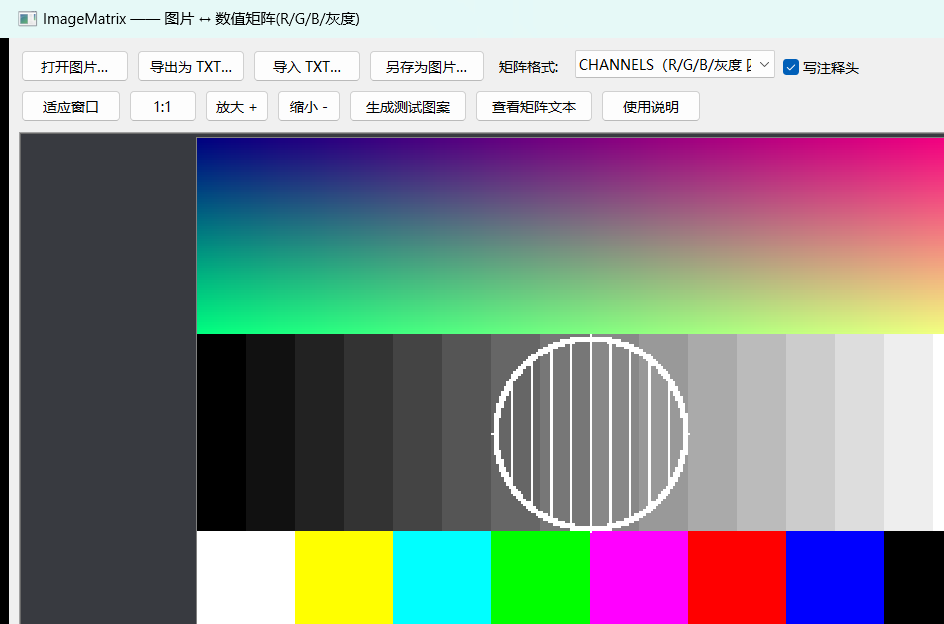

# ImageMatrix —— 图片 ↔ 数值矩阵（R/G/B/灰度）转换程序

一个完全用 **C/C++** 编写的 Windows 小程序：

* 把图片“识别”成由 **R、G、B、灰度值** 等向量组成的矩阵，导出成 **TXT** 文本；
* 反过来读取 TXT 矩阵，**还原成图片**；
* 带完整的 **图形界面（Win32 API）**，也提供命令行模式用于批处理和自检。

不依赖任何第三方库：BMP 编解码是自己写的，PNG/JPEG/GIF/TIFF 走 Windows 自带的 GDI+
（系统组件，代码仍是纯 C++ 调用），GUI 全部是 Win32 API。

---

## 0. 一键安装包

最新安装包在 [Releases](https://github.com/Yukinoshita-lin/ImageMatrix/releases) 下载；
也可用 `setup\build.cmd` 自行构建。运行 `ImageMatrix_Setup.exe` 即完成安装，无需管理员权限：

* 程序释放到 `%LOCALAPPDATA%\Programs\ImageMatrix`（约 6 MB，全静态链接，拷走也能直接用）；
* 自动创建开始菜单文件夹、桌面快捷方式；
* 在「设置 - 应用 - 安装的应用」注册为 ImageMatrix，可一键卸载（或用开始菜单里的“卸载 ImageMatrix”）。

安装器本体是本仓库自带的纯 C 源码（`setup\src\`），程序文件作为资源嵌入
setup.exe；在 `setup\` 下运行 `build.cmd` 可重新打包（先用 `build.bat` 构建应用本体）。

---

## 1. 功能一览

| 功能 | 说明 |
| --- | --- |
| 打开图片 | BMP / PNG / JPEG / GIF / TIFF；支持把文件直接拖进窗口 |
| 导出 TXT 矩阵 | 5 种矩阵排布：CHANNELS（R+G+B+灰度 四个矩阵）、RGB、GRAY、HEX、RGBA |
| 导入 TXT 矩阵 | 还原成图片显示；缺宽高时弹窗询问宽度；自动识别格式、自动纠错 |
| 另存为图片 | PNG / JPEG / BMP / GIF / TIFF |
| 查看矩阵文本 | 窗口内直接预览当前图片的矩阵文本，可复制到剪贴板或直接导出 |
| 生成测试图案 | 没有素材时一键生成彩条/灰阶/渐变测试图 |
| 图像浏览 | 滚轮以光标为中心缩放、左键拖动平移、适应窗口、1:1、放大 8 倍以上显示像素网格 |
| 像素取值 | 状态栏实时显示鼠标所指像素的 `R/G/B/灰度` 与 `#RRGGBB` |
| 命令行 | `to-txt` / `to-image` / `info` / `gen` / `selftest` |

灰度公式（ITU-R BT.601，四舍五入）：

```
Y = round(0.299*R + 0.587*G + 0.114*B)
```

---

## 2. 编译

需要 **MinGW-w64 (g++)** 或任意支持 C++17 的 Windows 编译器；无需其它依赖。

### 方式一：一键脚本

```bat
build.bat
```

生成：

* `build\imagematrix.exe` —— 图形界面版（双击运行）
* `build\imagematrix-cli.exe` —— 命令行版

### 方式二：make

```bat
mingw32-make
mingw32-make selftest    :: 编译并运行自检
```

### 方式三：手工命令

```bat
g++ -std=c++17 -O2 -DUNICODE -D_UNICODE -Isrc -c src\image.cpp -o build\image.o
:: ... 其余源文件同理 ...
g++ -municode -mwindows -o build\imagematrix.exe build\*.o ^
    -static -lgdiplus -lcomctl32 -lcomdlg32 -lgdi32 -lole32 -luuid -lshell32 -luser32
```

> `-static` 会把 C++ 运行库静态链入 exe，生成的程序不依赖任何 DLL（只用到 Windows 系统 DLL），
> 拷到别的电脑上也能直接运行，同时避免被机器上其它软件的 `libstdc++-6.dll` 干扰。

---

## 3. 图形界面用法

1. 双击 `build\imagematrix.exe`。
2. 点 **打开图片…**（或把图片拖进窗口）。
3. 在“矩阵格式”下拉框里选一种排布，点 **导出为 TXT…**，选择保存位置。
4. 点 **导入 TXT…** 选择刚才的 TXT，程序会按矩阵把图片还原出来。
5. 点 **另存为图片…** 把还原结果保存成 PNG/JPEG/BMP 等。

快捷键：`Ctrl+O` 打开图片、`Ctrl+S` 导出 TXT、`Ctrl+T` 导入 TXT、`Ctrl+E` 另存为图片。
鼠标：滚轮缩放（以光标为中心）、左键拖动平移；放大 8 倍以上会显示像素网格。

---

## 4. TXT 矩阵格式

导出的文件带注释头，读回时靠它准确还原（注释行都以 `#` 开头，任何解析器都能跳过）：

```
# ImageMatrix 1.0 - 图像数值矩阵 (image -> matrix)
# width 4
# height 3
# format CHANNELS
# max 255
# gray = round(0.299*R + 0.587*G + 0.114*B)
# 分通道矩阵：R 矩阵 -> G 矩阵 -> B 矩阵 -> GRAY 矩阵，每个矩阵 h 行 w 列

# channel R  (红色通道)
10 40 70 100
130 160 190 220
255 0 0 255
# channel G  (绿色通道)
...
```

### 5 种排布

| format | 内容 | 每行内容 |
| --- | --- | --- |
| `CHANNELS`（默认） | R 矩阵 + G 矩阵 + B 矩阵 + GRAY 矩阵 | 一行 = 图像的一行 |
| `RGB` | 颜色三元组 | 一行 = 一个像素：`R, G, B` |
| `RGBA` | 颜色四元组（含透明度） | 一行 = 一个像素：`R, G, B, A` |
| `GRAY` | 灰度矩阵 | 一行 = 图像的一行（width 个灰度值） |
| `HEX` | 16 进制颜色 | 一行 = 一个像素：`RRGGBB` |

### 读取端的容错能力

* 分隔符支持空格、逗号、分号、竖线、制表符、括号（`10, 20, 30`、`(10 20 30)` 都能读）；
* 数值可以是 `0-255` 整数，也可以是 `0-1` 归一化小数（自动识别，或用 `# max 1` 声明）；
* 支持 `# width/# height/# format/# max/# channel` 等注释键，键名大小写不敏感；
* 没有注释头时：等宽的数值矩阵会按“行 × 列”自动推断宽高；判断不了宽度的（例如每行一个
  RGB 像素）会在界面上询问宽度，命令行则可用 `--width N` 指定；
* 数据比宽高多时按宽高截断，少时补 0，并在界面上给出提示。

---

## 5. 命令行用法

```bat
build\imagematrix-cli.exe to-txt   -i photo.png -o photo.txt -f CHANNELS
build\imagematrix-cli.exe to-image -i photo.txt -o back.png
build\imagematrix-cli.exe info     -i photo.png
build\imagematrix-cli.exe gen      -o pattern.png -w 320 -h 240
build\imagematrix-cli.exe selftest            :: 20 项自检
build\imagematrix-cli.exe gui                 :: 启动图形界面
```

参数：`-f RGB|RGBA|GRAY|CHANNELS|HEX`、`--no-header`（不写注释头）、`--width N`、`-q 92`（JPEG 质量）。

---

## 6. 示例文件

`examples\` 里有一张 24×16 的测试图 `pattern_24x16.png`，以及它对应的 5 种矩阵文本
（`pattern_CHANNELS.txt` / `pattern_RGB.txt` / `pattern_GRAY.txt` / `pattern_HEX.txt` /
`pattern_RGBA.txt`），可以直接用程序导入看效果：

```bat
build\imagematrix-cli.exe info     -i examples\pattern_CHANNELS.txt
build\imagematrix-cli.exe to-image -i examples\pattern_HEX.txt -o back.png
```

---

## 7. 自检与验证

```bat
build\imagematrix-cli.exe selftest -d build\selftest_out
powershell -ExecutionPolicy Bypass -File test\verify.ps1
powershell -ExecutionPolicy Bypass -File test\gui_smoke.ps1
```

* **selftest（20 项）**：BMP/PNG/JPEG/TIFF 往返、5 种 TXT 格式往返（像素级比对）、
  灰度值逐点核对、无注释头/缺宽度/归一化数值/手写矩阵等容错路径。
* **verify.ps1**：不依赖程序自身编解码做对照——用脚本手工构造 BMP、手工编写 TXT，
  再逐像素核对导出的矩阵数值与还原出的图片字节。
* **gui_smoke.ps1**：启动图形界面，自动点击“生成测试图案/查看矩阵文本/导出为 TXT/打开图片”，
  驱动真实的文件对话框，并验证「GUI 导出的 TXT 与命令行导出的 TXT **SHA256 完全相同**」，
  截图保存在 `build\gui_out`。

（两个 `.ps1` 脚本是 UTF-8 **带 BOM** 的，中文才能被 Windows PowerShell 正确读取。）

---

## 8. 源码结构

```
ImageMatrix/
├─ build.bat             一键编译（ASCII，避免 cmd 代码页问题）
├─ Makefile              mingw32-make 用
├─ res/
│   ├─ app.rc            资源脚本（版本信息 + 清单）
│   └─ app.manifest      Common Controls v6 视觉样式、DPI 感知
├─ src/
│   ├─ util.h            UTF-8/UTF-16 转换、路径与字符串工具
│   ├─ image.h/.cpp      核心图像类型（0xAARRGGBB）、格式识别、读写入口、测试图案
│   ├─ bmp.h/.cpp        自写 BMP 编解码（1/4/8/16/24/32 位、位域、上下行序）
│   ├─ gdiplus_io.h/.cpp 借助系统 GDI+ 读写 PNG/JPEG/GIF/TIFF
│   ├─ matrix.h/.cpp     图像 ↔ TXT 矩阵（导出、容错解析、格式推断）
│   ├─ gui.h/.cpp        Win32 图形界面（按钮、画布缩放平移、矩阵预览窗、询问窗）
│   └─ main.cpp          命令行实现 + GUI/控制台两种入口
└─ test/
    ├─ verify.ps1        独立数值验证
    └─ gui_smoke.ps1     图形界面自动化冒烟测试
```

### 实现要点

* 像素在内存中是 `0xAARRGGBB`，与 Windows DIB / GDI+ 的字节序一致，显示时零拷贝；
* 画布用 `CreateDIBSection`（负高度 = 自上而下）直接映射内存，`StretchBlt` 显示，
  放大时取最近邻保证像素清晰，缩小时 HALFTONE 平滑；
* 灰度值在 C++ 内用整数运算 `(299R+587G+114B+500)/1000`，避免浮点误差，
  与文档里的公式逐点一致（自检里专门核对了这一点）。

---

## 9. 常见问题

**Q：导出的 TXT 很大？**
一个像素在 `CHANNELS` 格式下会产生 4 个数值（R/G/B/灰度）。1920×1080 的图片约 830 万个数值、
几十 MB 文本。只要矩阵，用 `GRAY`；只要颜色，用 `RGB`。程序里所有读写都是流式的，
几十 MB 的 TXT 也能正常处理（上限 1GB）。

**Q：导入的 TXT 提示“缺少宽度信息”？**
说明文件里没有 `# width` 注释头，而且每行只有 3/4 个数值（无法判断是“一个像素的三通道”
还是“宽度为 3 的灰度矩阵”）。按提示输入宽度即可；命令行加 `--width N`。

**Q：为什么不用 .jpg 保存透明背景？**
JPEG 本身不支持透明。带透明通道的图片请存成 PNG/BMP。

**Q：GUI 里能看的格式和能存的格式不一样？**
读：BMP/PNG/JPEG/GIF/TIFF；写：PNG/JPEG/BMP/GIF/TIFF（系统 GDI+ 提供的编码器，
Windows 10/11 还额外支持 HEIF 等，取决于系统安装的扩展）。

---

## 10. 截图




更多界面截图见 `docs/screenshots/`。

---

## 11. 许可证

本项目以 [Apache License 2.0](LICENSE) 发布，附带 [NOTICE](NOTICE) 文件。
依赖仅限 Windows 系统自带组件（Win32 API / GDI+ / UCRT / Common Controls），
未捆绑任何第三方库，因此无额外第三方许可义务。

宣传视频的渲染脚本（`promo/`，Python + PIL + ffmpeg）与安装器源码
（`setup/src/`，纯 C）同样以 Apache-2.0 提供，均可在本仓库内重新构建。
